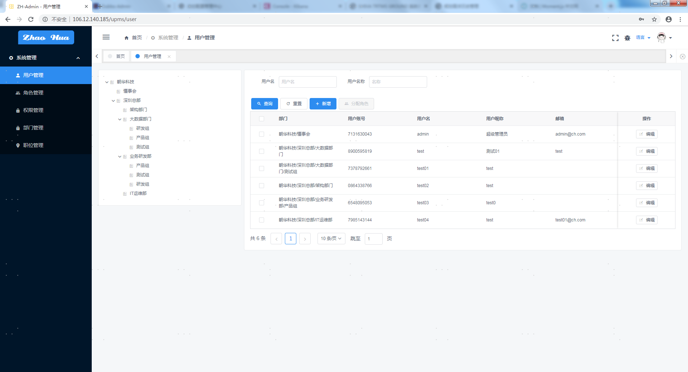

## 简介

一款极简后台管理系统，提供基本功能（用户权限管理），使用最新组织结构可视化组件。可以用于所有的Web应用程序，如网站管理后台，网站会员中心，CMS，CRM，OA。采用前端后台分离框架，代码封装过后十分精简易上手，出错概率低。
> 使用技术/框架
- 采用前后端分离的模式，单应用版本前端([iview-admin](https://github.com/iview/iview-admin));
- 后端采用Spring Boot + Ebean 12;
- 权限认证使用Interceptor + token过滤认证;
- 使用caffeine cache缓存用户与权限。

## 功能 

- 用户管理：用户是系统操作者，该功能主要完成系统用户配置。
- 组织管理：配置系统组织机构（公司、部门、小组），树结构展现支持数据权限。
- 职位管理：配置系统用户所属担任职务。
- 菜单管理：配置系统菜单，操作权限，按钮权限标识等。
- 角色管理：角色菜单权限分配、设置角色按机构进行数据范围权限划分。

#### 预览
预览地址：[106.12.140.185/admin](http://106.12.140.185/admin/)
>效果

|  登录  | 主页 |
|  ----  | ----  |
|   |  |
|  用户管理  | 角色管理  |
|   |  |
|  组织管理  | 职位管理  |
|   |  |
|  权限管理  | 数据字典  |
|   |  |

## 文档

1.打包
```
mvn clean package -P npm -Denv=release -Dmaven.test.skip
```
2.执行
```
sh bin/start.sh
```

## 多语言
- EN 英语
- CN 中文简体
- TW 中文繁体

- 参考文档: [iview-admin](https://github.com/iview/iview-admin)

## 相关开源

- [朝华微服务框架](https://github.com/zhimin711/ch-cloud)

## 问题反馈
- 报告 issue: [github issues](https://github.com/zhimin711/zh-admin/issues)
